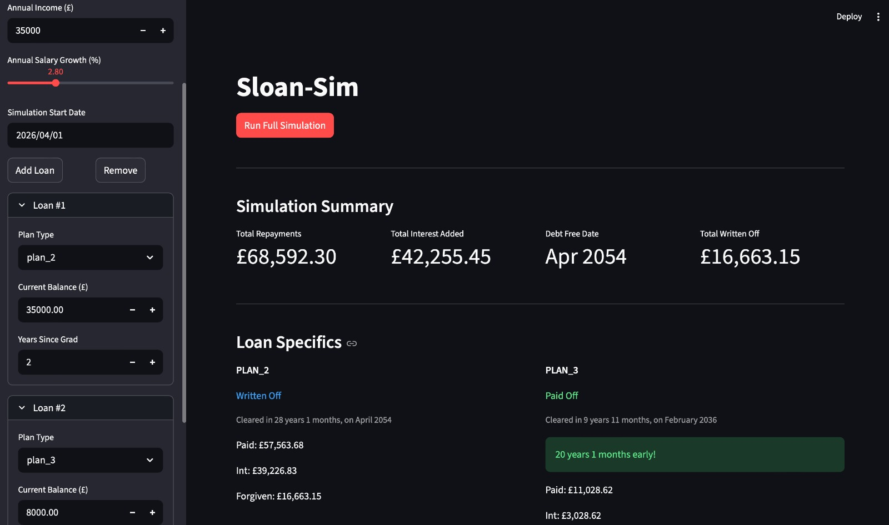
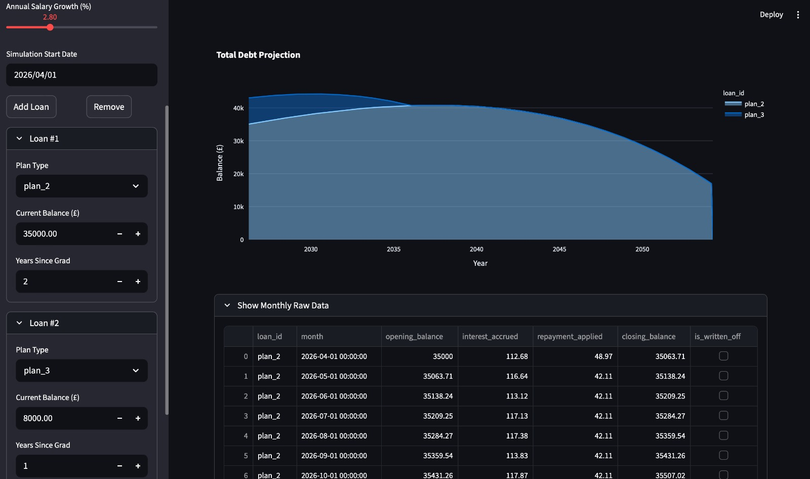

# sloan-sim

**A high-precision Student Loan Company (SLC) repayment simulator for the UK.**



Sloan-Sim provides a month-by-month projection of UK student loan balances, accounting for the complex interplay between RPI, BoE base rates, salary growth, and the specific repayment hierarchies across different loan plans.

<br></br>

## Features
- Multi-Plan Support: Accurate logic for Plans 1, 2, 4, 5, and Plan 3 (Postgraduate).
- Compound Interest Modeling: Implements the SLC methodology of daily interest accrual with monthly application.
- Repayment Hierarchy: Correctly prioritizes Undergraduate repayments over Postgraduate as per current regulations (FR-4).
- Insightful Metrics:
    - Total Cost of Borrowing: Total interest paid over the life of the loan.
    - Early Payoff Tracking: Calculates time saved compared to the statutory write-off date.
    - Write-Off Projections: Estimates the amount of debt eventually forgiven.

<br></br>



<br></br>

## Project Structure
The project is built with a focus on data integrity and modularity:
    - `src/core/simulation_engine.py`: The main simulation loop handling salary growth and monthly snapshots.
    - `src/core/loan_engine.py`: Core classes for Users and Loan Products.
    - `src/core/models.py`: A rich object-oriented model (SimulationResult) that encapsulates all aggregate metrics.
    - `src/plans/`: Individual implementation classes for each SLC Plan, ensuring specialized interest logic (e.g., Plan 2's sliding scale).
    - `app.py`: A Streamlit-based dashboard for interactive visualization and "What If" analysis.

The engine calculates the effective interest rate $r$ based on the borrower's plan and income. 
For example, Plan 2 interest is calculated as:
$$r = \text{RPI} + \text{Sliding Scale (0\% to 3\% based on income)}$$

Limited by the **Prevailing Market Rate (PMR)** cap.

The simulation runs until all balances reach £0 or the loan hits its anniversary write-off date:
$$\text{Remaining Months} = (\text{Term} - \text{Years Since Graduation}) \times 12$$

<br></br>

## Installation & Usage
**1. Clone the repo**:

```bash
git clone https://github.com/jpawebb/sloan-sim.git
cd sloan-sim
```

**2. Sync dependencies and creat virtual environment**:

```bash
uv sync
```

**3. Run the dashboard**:
```bash
uv run streamlit run app.py
```

<br></br>

## Configuration
Interest rates (RPI, BoE Base), thresholds, and repayment rates are managed via `src/core/config.py`. This file should be updated to reflect the latest fiscal year changes (e.g., the 2026/27 threshold updates), but if not, this is the single-source-of-truth for configuring economic metrics.